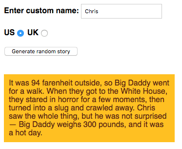

# Silly Story Generator

In this mini-project I have developed a small funny web application that generates silly stories, as part of my full stack JavaScript training offered by [GOMYCODE Tunisia](https://www.gomycode.tn)

## Project brief

This is a small web application wich does the following:

* Generates a silly story when the "Generate random story" button is pressed.

* Replaces the default name "Bob" in the story with a custom name, only if a custom name is entered into the "Enter custom name" text field before the generate button is pressed.
* Converts the default US weight and temperature quantities and units in the story into UK equivalents if the UK radio button is checked before the generate button is pressed.
* Will generate another random silly story if you press the button again (and again...)

The following screenshot shows an example of what the finished program should output:

	

## What I have learned

* Select `html elements`using `document.querySelector`.

* How to use `Math.random` to build an function that return random elments from a given array.

* How to use the `replace` built in function on `strings`.

* How to use `Math.round`to round a floating point number to the nearest integer.